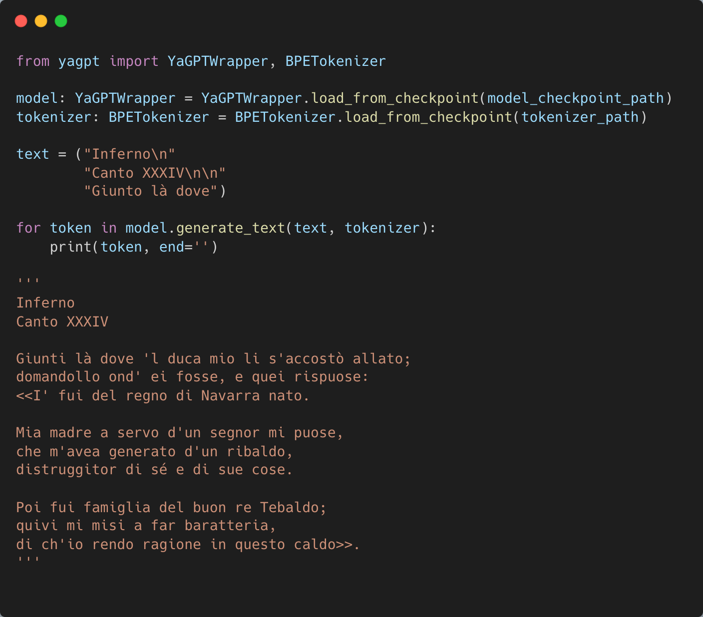

# YaGPT: A Decoder-Only Transformer from Scratch in PyTorch

  <!-- Placeholder for an image showing the model generating text -->

**YaGPT** is an implementation of a **decoder-only transformer** architecture, built entirely from scratch using PyTorch. The project serves as an educational example, designed to help understand the fundamental components of an autoregressive transformer model.

To demonstrate its capabilities, YaGPT was trained exclusively on **Dante Alighieri's *Divina Commedia*** for just 3 hours on a standard laptop. The model is small, with only **8.8 million parameters**, making it suitable for limited computational resources.

---

## 🌐 Introduction to Transformer Architecture

Transformers, introduced by Vaswani et al. in ["Attention Is All You Need"](https://arxiv.org/abs/1706.03762), revolutionized natural language processing with their **self-attention mechanism**. Unlike RNNs, transformers process sequences in parallel, enabling greater efficiency on modern hardware.

A **decoder-only transformer**, like the one implemented here, focuses solely on generating sequences token by token, conditioned on the previously generated tokens.

---
## 🏗️ Model Architecture

YaGPT follows a simplified yet faithful implementation of the decoder architecture with the following components:

1. **Tokenization**: Text is split into tokens (words or subwords).
2. **Embedding Layer**: Tokens are transformed into dense vector representations.
3. **Positional Encodings**: Positional information is added to embeddings.
4. **Transformer Decoder Blocks**: A series of layers comprising self-attention and feed-forward networks.
5. **Output Layer**: Predicts probabilities for the next token in the sequence.

### Model Hyperparameters

- **seq_len**: Maximum input sequence length.
- **d_model**: Dimensionality of token embeddings.
- **n_heads**: Number of attention heads in each transformer layer.
- **n_layers**: Number of decoder layers.
- **d_ff**: Dimensionality of the feed-forward network.
- **dropout**: Dropout rate for regularization.
- **vocab_size**: Vocabulary size derived from the training dataset.

With only **8.8 million parameters**, YaGPT is intentionally compact and accessible for experimentation on limited hardware.

---

## ✍ Training on the Divina Commedia

YaGPT was trained from scratch on Dante’s *Divina Commedia* for **3 hours on a laptop**, with the goal of capturing its unique style, language, and structure. While the training duration was short, the results are a proof of concept for the decoder-only transformer architecture.

### How to Train

To train YaGPT on your dataset, follow these steps:

1. Clone this repository and navigate to the root directory.
2. Run the training script:

   ```bash
   python scripts/train.py --dataset_path [DATASET_PATH] --batch_size [BATCH_SIZE] --d_model [D_MODEL] --seq_len [SEQ_LEN] --n_heads [N_HEADS] --n_layers [N_LAYERS] --dropout [DROPOUT] --max_epochs [MAX_EPOCHS] --lr [LEARNING_RATE]
   ```

---

## 📊 Results

### Performance and Generated Output

The model's output was evaluated qualitatively for coherence, fluency, and adherence to Dante's style. Below is an example:

```
>>> Input prompt <<<
Inferno
Canto XXXIV

Giunti là dove
>>> Generated text <<<
'l duca mio li s'accostò allato;
domandollo ond' ei fosse, e quei rispuose:
<<I' fui del regno di Navarra nato.

Mia madre a servo d'un segnor mi puose,
che m'avea generato d'un ribaldo,
distruggitor di sé e di sue cose.

Poi fui famiglia del buon re Tebaldo;
quivi mi misi a far baratteria,
di ch'io rendo ragione in questo caldo>>.
```

---

## 🚀 Project Goals

1. Provide a **clear and educational implementation** of a transformer decoder.
2. Offer a starting point for experimenting with the transformer architecture without relying on advanced libraries.
3. Demonstrate how even a **small, simple model** can learn stylistic features from a limited dataset.
